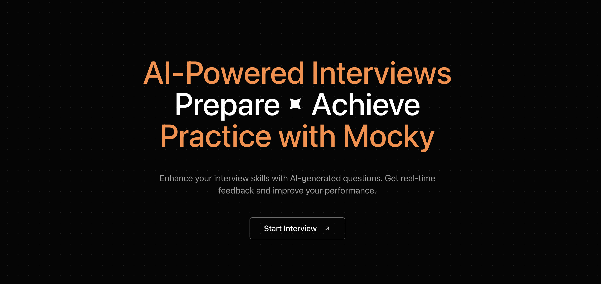

# Mocky

  

## 🌟 About Mocky

**Mocky** is an AI-powered mock interview platform designed to help users prepare for technical interviews. It allows users to select a technical topic, role, duration, and experience level to simulate a realistic interview experience. By requiring verbal answers, Mocky helps users enhance their communication skills. AI-driven feedback provides insights to improve performance effectively.

## 🚀 Deployed URL

Experience Mocky live at: [https://mocky-chi.vercel.app/](https://mocky-chi.vercel.app/)

## 🛠️ Tech Stack

- **Frontend**: [Next.js 15](https://nextjs.org/), [React](https://reactjs.org/), [TypeScript](https://www.typescriptlang.org/), [Tailwind CSS](https://tailwindcss.com/)
- **Backend**: [Neon DB](https://neon.tech/), [Prisma ORM](https://www.prisma.io/)
- **Authentication**: [Auth.js](https://authjs.dev/)

## ✨ Features

- **Topic Selection**: Choose from a variety of technical topics for the interview.
- **Customizable Interview**: Specify the target role, interview duration, and experience level.
- **Communication Practice**: Users must speak their answers, improving verbal communication skills.
- **AI Feedback**: Receive AI-generated feedback based on the answers provided during the interview.

---
